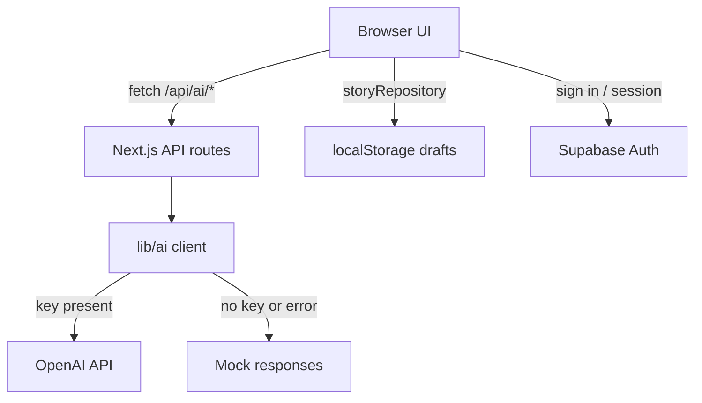

# Architecture

> **What this file is for:** A high-level map of how Zap! is put together — screens, auth, AI, and where story data lives. Prefer this over digging through every file when you need the big picture.
>
> Related: [tech-stack.md](tech-stack.md) · [folder-structure.md](folder-structure.md) · [database.md](database.md) · [prototype-slice-1.md](../project-shaping/prototype-slice-1.md)

---

## Product shape (Slice 1)

Zap! is a classroom storytelling helper for ESL teachers. The working prototype follows this flow:

```text
Landing (/)
  → Login / Signup / Forgot / Reset password
  → Dashboard (list drafts, create story)
  → Story Starters wizard (/stories/new)
  → Generate opening scene (AI)
  → Story workspace (/stories/[id])
  → Continue with custom direction or Plot Ideas
  → Draft auto-saves; resume from dashboard
```

Wizard progress is **not** saved until the teacher taps **Zap!** and an opening scene is generated.

---

## Layers

| Layer | Role | Where it lives |
|-------|------|----------------|
| **UI pages** | Screens the teacher sees | `src/app/**/page.tsx` |
| **UI components** | Reusable pieces (modals, brand, auth shell) | `src/components/` |
| **API routes** | Server endpoints the browser calls | `src/app/api/` |
| **AI helpers** | Prompts, OpenAI calls, mock fallbacks | `src/lib/ai/` |
| **Data** | Story draft persistence | `src/lib/data/` |
| **Auth** | Supabase email/password session | `src/lib/supabase/`, `AuthProvider` |
| **Types** | Shared TypeScript shapes | `src/lib/types.ts` |



---

## App routes (pages)

| Path | Purpose |
|------|---------|
| `/` | Landing |
| `/login`, `/signup` | Auth |
| `/forgot-password`, `/reset-password` | Password recovery |
| `/dashboard` | Teacher home — drafts + create story |
| `/stories/new` | Story Starters wizard |
| `/stories/[id]` | Story workspace |

Protected teaching screens wrap content in `RequireTeacher` (client redirect to `/login` if signed out).

---

## API routes (AI)

All are **POST**, run on the **server**, and must never receive the OpenAI key in the browser.

| Path | Purpose |
|------|---------|
| `/api/ai/opening` | Generate opening scene from wizard setup |
| `/api/ai/continue` | Continue story with a direction |
| `/api/ai/plot-ideas` | Three “what happens next?” ideas in the workspace |
| `/api/ai/wizard-ideas` | One character / setting / story suggestion in the wizard |

Responses typically include generated text (or ideas) plus `usedMock: boolean` when falling back to local mock content.

---

## Auth (Supabase)

**Implemented:**

- Browser client (`src/lib/supabase/client.ts`)
- Session refresh middleware (`middleware.ts` → `src/lib/supabase/middleware.ts`)
- `AuthProvider` — sign up, sign in, sign out, session sync
- Forgot / reset password pages
- Client-side protection via `RequireTeacher`

**Not fully wired yet:**

- Server Supabase client (`src/lib/supabase/server.ts`) exists but is unused
- Middleware refreshes cookies; it does **not** block unauthenticated page access by itself
- `SUPABASE_SERVICE_ROLE_KEY` is documented in `.env.example` but unused in code

Auth is separate from story storage today (see [database.md](database.md)).

---

## Data layer

- Interface: `StoryRepository` in `src/lib/data/story-repository.ts`
- Active implementation: `LocalStoryRepository` → browser `localStorage` key `zap.storyDrafts.v1`
- Designed so a future `SupabaseStoryRepository` can swap in without rewriting UI

Story narrative helpers (joining beats, appending continuations) live in `src/lib/story/engine.ts` and do not persist by themselves.

---

## Client vs server boundaries

| Must stay on the server | OK in the browser |
|-------------------------|-------------------|
| `OPENAI_API_KEY` / OpenAI SDK usage | Supabase anon key (`NEXT_PUBLIC_*`) |
| `src/lib/ai/client.ts` (called from API routes only) | Pages, components, `AuthProvider` |
| Service role key (if used later) | `storyRepository` localStorage calls |

Rule of thumb: anything that costs money or holds a secret goes through an API route under `src/app/api/`.

---

## Key UI overlays

| Component | Used on | Role |
|-----------|---------|------|
| `WizardIdeaModal` | `/stories/new` | AI suggestion for Characters / Setting / Story |
| `PlotIdeasOverlay` | `/stories/[id]` | Pick one of three continuation directions |
| `FullScreenReader` | `/stories/[id]` | Large-text reading mode |

---

## Gaps / TBD

- Cloud sync of story drafts (planned; not implemented)
- Server-side route guarding beyond session refresh
- No SQL migrations or app tables in the repo yet
