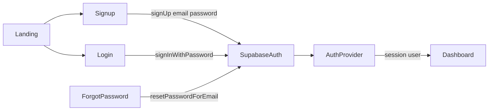

# Supabase Auth UI

| | |
|---|---|
| **Status** | Implemented |
| **Area** | Landing, Login, Signup, Forgot/Reset password, AuthProvider |
| **Source** | Cursor plan `supabase_auth_ui_3a05822a` (cleaned for docs; originals stay in `~/.cursor/plans/`) |

---

## Goal

Teachers can **sign up** and **log in** with email/password via Supabase, on pages that look like the landing page. Stub “Enter as teacher” goes away as the primary path.

**Out of scope for this build:** Google OAuth, migrating story drafts from localStorage to Supabase, student accounts.

---

## Visual approach (Login + Signup)

Reuse the landing composition from [`src/app/page.tsx`](../../src/app/page.tsx):

- Full Ben Day background (already global)
- Large white `zap-panel-white` card (`max-w-4xl`)
- Header: Zap! logo + “Story Gen” left; nav links right (Login / Signup, highlight current)
- Two-column body on desktop: book mascot left, form right
- Primary CTA: peach/orange `zap-btn-primary` with red label (“Log in” / “Sign up”)
- Thick black borders, Fredoka/Nunito — same tokens as landing

Shared shell:

- New: [`src/components/AuthPageShell.tsx`](../../src/components/AuthPageShell.tsx) — layout only (logo, nav, mascot, children slot for the form)
- Update: login, signup, and forgot-password pages with the same shell
- Forms enabled (email, password; signup also display name); clear errors; loading on submit

---

## Supabase auth architecture

### Packages and clients

- `@supabase/supabase-js` and `@supabase/ssr`
- [`src/lib/supabase/client.ts`](../../src/lib/supabase/client.ts) — browser client
- [`src/lib/supabase/server.ts`](../../src/lib/supabase/server.ts) — server client (for later protected routes)
- [`src/lib/supabase/middleware.ts`](../../src/lib/supabase/middleware.ts) + root [`middleware.ts`](../../middleware.ts) — refresh session cookies

### Env

- `NEXT_PUBLIC_SUPABASE_URL`
- `NEXT_PUBLIC_SUPABASE_ANON_KEY`
- Keep `SUPABASE_SERVICE_ROLE_KEY` out of client code (not needed for email/password login)

### Replace stub auth

Update [`AuthProvider`](../../src/components/providers/AuthProvider.tsx):

- On load: `getSession()` + `onAuthStateChange`
- Expose: `user`, `ready`, `signIn`, `signUp`, `signOut`, `resetPassword`
- Map Supabase user → app `AuthUser` (`id`, `email`, `displayName` from metadata or email prefix)
- Remove stub “Enter as teacher” as the primary path

### Landing CTA

**Zap!** → `/signup` (or `/dashboard` if already signed in).

### Route protection

[`RequireTeacher`](../../src/components/RequireTeacher.tsx) gates on real session; unauthenticated users → `/login`.

---

## Supabase dashboard setup (one-time, manual)

1. **Authentication → Providers → Email** enabled
2. For local prototyping: turn **off** “Confirm email” so signup can land on the dashboard immediately (turn on later if desired)
3. **URL config**: Site URL `http://localhost:3000`; redirect URLs include `http://localhost:3000/**`
4. Optional: friendly sender name under Auth email templates

---

## Page behavior

| Page | Behavior |
|------|----------|
| Signup | `signUp` → `/dashboard` (or “check your email” if confirmation is on) |
| Login | `signInWithPassword` → `/dashboard` |
| Forgot password | `resetPasswordForEmail` → reset page / success message |
| Reset password | `updateUser({ password })` after email link |
| Dashboard Sign out | `signOut` → `/` |

Story drafts stay in **localStorage**. Auth identity is real; cloud story storage is a later step.

---

## Acceptance checks

1. Landing spirit unchanged; Zap! → signup (or dashboard if logged in)
2. Login/Signup match landing panel + mascot layout
3. Create account with email/password → dashboard
4. Log out → log in again with same credentials
5. Protected routes redirect to login when signed out
6. Forgot-password styled and sends reset email (or clear success message)
7. App still builds

---

## Files touched (as implemented)

**New**

- `src/components/AuthPageShell.tsx`
- `src/lib/supabase/client.ts`, `server.ts`, `middleware.ts`
- `middleware.ts` (root)
- `src/app/reset-password/page.tsx`

**Edited**

- `src/components/providers/AuthProvider.tsx`
- Auth pages (login, signup, forgot-password), landing, dashboard
- `.env.example`, `package.json`

**Removed / retired**

- Stub auth as primary path (`src/lib/auth/stub-auth.ts` deleted in this work)
