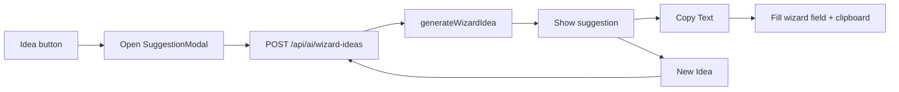

# Wizard AI Suggestion Modals

| | |
|---|---|
| **Status** | Implemented |
| **Area** | Story Starters wizard (`/stories/new`) |
| **Source** | Cursor plan `wizard_idea_modals_595f063d` (cleaned for docs; originals stay in `~/.cursor/plans/`) |

---

## Goal

Build the Character / Setting / Story AI suggestion modals from the design mockups, wire them to the wizard **Idea** buttons, and add an AI endpoint with mock fallback (same pattern as plot ideas).

Mockups: [docs/design/mockups/](../design/mockups/) (`character-suggestion-modal.png`, `setting-suggestion-modal.png`, `story-suggestion-modal.png`).

---

## Approach

Match the mockup layout (single suggestion, mascot, **Copy Text** / **New Idea**, X close). Reuse the existing AI stack: API route → `client.ts` → prompts + mock fallback when no OpenAI key.

One shared overlay parameterized by category; one API route with a `category` param.

**Apply behavior:** **Copy Text** copies to the clipboard **and** fills the matching wizard field. Characters fill the first empty slot (or slot 0 if all filled). Setting / Story replace their textarea. **New Idea** regenerates without closing.

---

## UI: shared modal

[`src/components/WizardIdeaModal.tsx`](../../src/components/WizardIdeaModal.tsx)

- Backdrop: `fixed inset-0 z-40 … bg-black/45` (same idea as `PlotIdeasOverlay`)
- Panel: `zap-panel`, wider (`max-w-2xl`), `animate-pop`
- Layout: left = idea mascot (`/brand/idea-mid.png`); right = title + “Here’s an idea for you!” + white suggestion box + actions
- Titles: **Character Ideas** / **Setting Ideas** / **Story Ideas**
- Close: top-right **X**
- States: loading, error, optional mock banner
- Actions: **Copy Text** and **New Idea**

---

## Wire wizard Idea buttons

[`src/app/stories/new/page.tsx`](../../src/app/stories/new/page.tsx)

- Enable the three Idea buttons (remove Slice 1 “coming soon” disabled state)
- State: `ideaCategory`, `ideaText`, `ideaLoading`, `ideaError`, `ideaMock`
- Idea click → open modal + fetch
- Copy Text → clipboard + update `characters` / `setting` / `storyStarter`
- New Idea → refetch for the same category

---

## AI backend

| Piece | Role |
|-------|------|
| `src/lib/ai/prompts.ts` | `wizardIdeaPrompt(category, partialSetup)` — one short classroom-friendly suggestion |
| `src/lib/ai/mock.ts` | `mockWizardIdea(category)` — rotating examples per category |
| `src/lib/ai/client.ts` | `generateWizardIdea` → `{ text, usedMock }` |
| `src/app/api/ai/wizard-ideas/route.ts` | `POST` `{ category, characters?, setting?, storyStarter? }` → `{ text, usedMock }` |

Partial setup is passed so suggestions stay coherent with fields already filled.

---

## Files touched

**New**

- `src/components/WizardIdeaModal.tsx`
- `src/app/api/ai/wizard-ideas/route.ts`

**Edited**

- `src/app/stories/new/page.tsx`
- `src/lib/ai/prompts.ts`, `mock.ts`, `client.ts`

**Asset**

- Reuse `public/brand/idea-mid.png`

No changes to Plot Ideas overlay or the story workspace.
